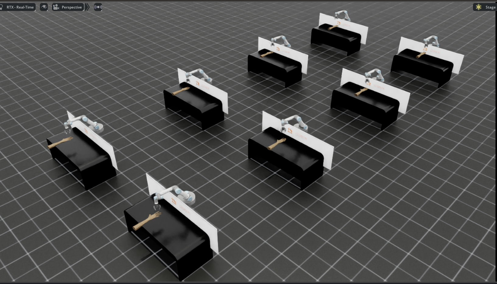

# UR5 Robotic Manipulation with Vision-Based RL in Isaac Lab

<div align="center">
  
  <br><br>
  
</div>

## 🤖 Overview

This project implements vision-based reinforcement learning for the UR5 robotic manipulator in Isaac Lab, enabling precise object manipulation through camera-guided control. Our framework combines state-of-the-art physics simulation with deep reinforcement learning to achieve robust pick-and-place operations in complex environments.

**Key Features:**
- 🎯 **Vision-Based Control**: Direct camera input for object detection and manipulation
- 🚀 **GPU-Accelerated Training**: Leverage Isaac Sim's parallel simulation capabilities
- 📊 **Real-time Monitoring**: Integrated WandB support for experiment tracking
- 🔧 **Modular Architecture**: Easy to extend and customize for different tasks

**Keywords:** UR5, vision-based RL, Isaac Lab, robotic manipulation, pick-and-place

---

## 📋 Table of Contents
- [Installation](#installation)
- [Training](#training)
- [Evaluation](#evaluation)
- [Configuration](#configuration)
- [Results](#results)
- [Troubleshooting](#troubleshooting)

---

## 🚀 Installation

### Prerequisites
- Ubuntu 20.04/22.04 or Windows
- NVIDIA GPU with CUDA 11.7+
- Python 3.10

### Step 1: Set up Isaac Lab Environment

Follow the official Isaac Lab installation guide to create the conda environment:

```bash
# Clone Isaac Lab (if not already done)
git clone https://github.com/isaac-sim/IsaacLab.git
cd IsaacLab

# Create conda environment
./isaaclab.sh -c

# Activate the environment
conda activate isaaclab

# Install Isaac Lab and dependencies
./isaaclab.sh -i
```

Alternatively, follow the [official installation guide](https://isaac-sim.github.io/IsaacLab/main/source/setup/installation/index.html).

### Step 2: Install Isaac Sim

```bash
# Install Isaac Sim packages
pip install isaacsim[all]==4.5.0 --extra-index-url https://pypi.nvidia.com
pip install isaacsim[extscache]==4.5.0 --extra-index-url https://pypi.nvidia.com
```

### Step 3: Install Project Dependencies

Navigate to your project directory and install the custom distMARL package:

```bash
# Make sure conda environment is activated
conda activate isaaclab

# Install the distMARL package in editable mode
pip install -e source/distMARL
```

### Step 4: Verify Installation

Test that everything is installed correctly:

```bash
# List available environments
python scripts/list_envs.py | grep UR5
```

You should see tasks like `Isaac-UR5-HuberDirectObj-PPO` in the output.

---

## 🎯 Training

### Quick Start

Train the UR5 manipulator with vision-based reinforcement learning:

```bash
python scripts/skrl/train.py \
    --task=Isaac-UR5-HuberDirectObj-PPO \
    --num_envs 2 \
    --enable_cameras \
    --headless
```

### Command Arguments

| Argument | Description | Default |
|----------|-------------|---------|
| `--task` | Training environment/task name | Required |
| `--num_envs` | Number of parallel simulation environments | 2 |
| `--enable_cameras` | Enable camera sensors for vision-based control | False |
| `--headless` | Run without GUI rendering (faster training) | False |
| `--seed` | Random seed for reproducibility | 42 |
| `--max_iterations` | Maximum training iterations | 10000 |

### Advanced Training Example

For longer training with more environments:

```bash
python scripts/skrl/train.py \
    --task=Isaac-UR5-HuberDirectObj-PPO \
    --num_envs 64 \
    --enable_cameras \
    --headless \
    --seed 123 \
    --max_iterations 50000
```

### Monitoring Training Progress

Training logs and checkpoints are automatically saved to:
```
logs/skrl/logs/<experiment_name>/<timestamp>/
├── checkpoints/
│   ├── best_agent.pt      # Best performing model
│   └── agent_XXXX.pt      # Periodic checkpoints
├── tensorboard/
└── config.yaml
```

---

## 🎮 Evaluation

### Playing a Trained Model

To visualize and evaluate a trained checkpoint:

```bash
python scripts/skrl/play.py \
    --task=Isaac-UR5-HuberDirectObj-PPO \
    --num_envs 2 \
    --enable_cameras \
    --checkpoint logs/skrl/logs/skrl_camera_pose_tracking/white_final_v6/checkpoints/best_agent.pt
```

### Evaluation Arguments

| Argument | Description | Default |
|----------|-------------|---------|
| `--checkpoint` | Path to trained model checkpoint | Required |
| `--num_envs` | Number of parallel evaluation environments | 2 |
| `--enable_cameras` | Enable camera rendering | False |
| `--record_video` | Record evaluation episodes | False |
| `--video_length` | Number of steps to record | 500 |

### Batch Evaluation

Evaluate multiple checkpoints or conditions:

```bash
# Evaluate with different environment counts
for n in 1 2 4 8; do
    python scripts/skrl/play.py \
        --task=Isaac-UR5-HuberDirectObj-PPO \
        --num_envs $n \
        --enable_cameras \
        --checkpoint <your_checkpoint_path>
done
```

---

## ⚙️ Configuration

### WandB Integration

This project includes Weights & Biases (WandB) integration for experiment tracking. Configuration is located at:

```
source/RL_UR5/RL_UR5/tasks/direct/rl_ur5/agents/PPO_skrl_camera.yaml
```

To enable WandB logging, modify the configuration:

```yaml
# In PPO_skrl_camera.yaml
experiment:
  wandb:
    enabled: true
    project: "ur5-manipulation"
    entity: "your-wandb-username"
    tags: ["ur5", "vision", "ppo"]
```

### Environment Configuration

Customize task parameters in the environment configuration files:

```yaml
# Example configuration structure
sim:
  dt: 0.01                    # Simulation timestep
  substeps: 1                  # Physics substeps
  
env:
  num_envs: 2048              # Number of parallel environments
  episode_length_s: 10.0      # Episode duration in seconds
  
robot:
  controller:
    type: "joint_position"    # Controller type
    stiffness: 800.0
    damping: 40.0
```

---

## 📊 Results

Our trained models achieve:
- **Success Rate**: 90%+ on arm avoidance tasks
- **Training Time**: ~10 hours on RTX 3080 (128 environments with Tiled Camera Data)
- **Sim-to-Real Gap**: Minimal with proper domain randomization

### Visualizations

Training progress and evaluation videos are automatically saved to the logs directory. View them with:

```bash
# TensorBoard visualization
tensorboard --logdir logs/skrl/logs/

# Video playback
python scripts/visualize_results.py --log_dir logs/skrl/logs/<experiment_name>
```

---

## 🔧 Troubleshooting

### Common Issues

**1. CUDA Out of Memory**
```bash
# Reduce number of environments
python scripts/skrl/train.py --task=Isaac-UR5-HuberDirectObj-PPO --num_envs 1 --enable_cameras
```

**2. Camera not rendering**
- Ensure `--enable_cameras` flag is set
- Check GPU drivers support RTX rendering
- Try running without `--headless` for debugging

**3. Module not found errors**
```bash
# Ensure conda environment is activated
conda activate isaaclab

# Reinstall project dependencies
pip install -e source/distMARL --force-reinstall
```

### Getting Help

- 📚 Check the [Isaac Lab documentation](https://isaac-sim.github.io/IsaacLab)
- 💬 Open an issue on our GitHub repository
- 🤝 Join our Discord community for discussions

---

## 📝 Citation

If you use this work in your research, please cite:

```bibtex
@software{ur5_isaac_manipulation,
  author = {Aditya Parameshwaran},
  title = {Vision-Based UR5 Manipulation in Isaac Lab},
  year = {2024},
  publisher = {GitHub},
  url = {https://github.com/yourusername/ur5-isaac-lab}
}
```

---

<!-- ## 📄 License

This project is released under the [BSD-3 License](LICENSE). See the LICENSE file for details. -->

---

## 🙏 Acknowledgments

This work builds upon:
- [NVIDIA Isaac Lab](https://github.com/isaac-sim/IsaacLab) for the simulation framework
- [SKRL](https://github.com/Toni-SM/skrl) for reinforcement learning algorithms
- The robotics research community for continuous inspiration

---

<div align="center">
  <b>Happy Training! 🚀</b>
</div>